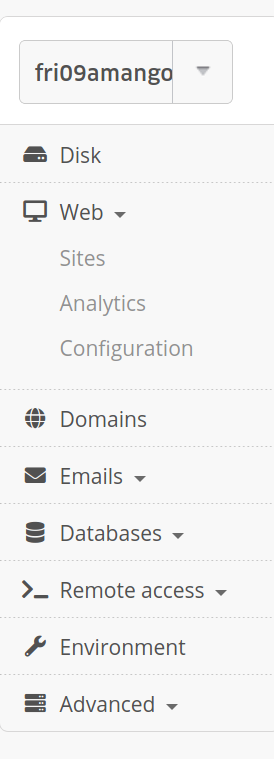
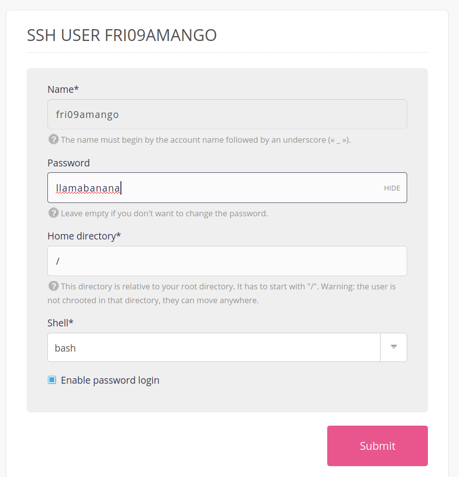
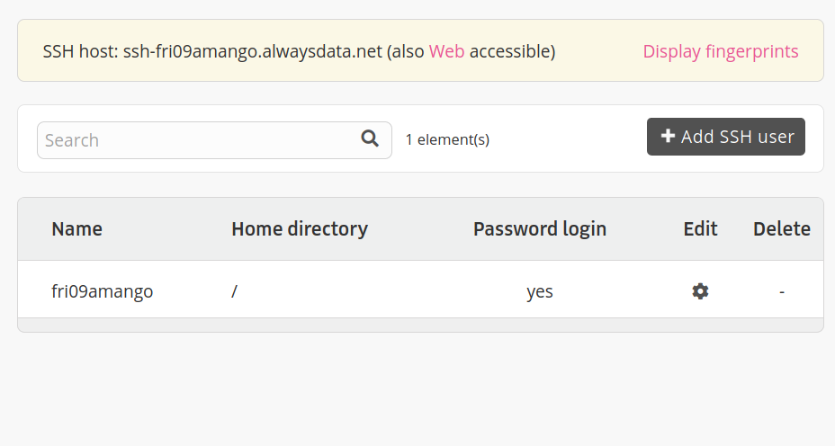

## Deploying with AlwaysData

A video guide of deploying with alwaysdata [can be found here](https://youtu.be/Bhsk0Ssv0VU).

### 5.6.1. One-time setup

1. Navigate to https://admin.alwaysdata.com/ and sign up with a new account (one per team is fine). Use a password you're happy both sharing with your team members and being made public on the internet in the worst case. Set your "Account name" as your 1531 group name (e.g. FRI09AMANGO) for simplicity. Don't worry about any of the "Payment" sections, you won't be charged any money.

2. After logging in, in the sidebar click on "Web > Sites" in the sidebar



3. Delete the "Default Site", and then click the "Install an an application" button and choose "Express.js" under "NodeJS"


4. On the details page, choose a name "COMP1531 Deployed", set the address to be the one stated immediately above the input as "currently unused" (this will be similar to your username), and for installation set it as as /www/cs1531deploy


5. On the "Web > Sites" page go to "Edit" for your one site.


6. Scroll down and change "Application path" to `home/YOUR-ACCOUNT-NAME/www/cs1531deploy` and change the Command to `npm start`. Click submit.


7. Navigate to the "Remote access" tab in the sidebar, and select "SSH". Click on the "edit" button for the one entry that is there.


8. Enter another password (another one you would be feel comfortable if became public in a worse case), and tick the "Enable password login" button.



9. Open `deploy.sh` in your cloned repository. You will need to replace the `TODO-TODO-TODO` with the following:
 * USERNAME: Your username you signed up with (e.g. fri09amango)
 * SSH_HOST: The name of the host at the top of the SSH page (e.g. ssh-fri09amango.alwaysdata.net)




10. In your server, change the port and IP used to the environment variables `process.env.PORT` `process.env.IP`, so that the app listens to the alwaysdata location when deployed there. You may need to convert the type of the environment variables to remove TypeScript errors. Be sure to leave `config.port` as the default port for your own development, outside of deployment.
```javascript
app.listen(parseInt(process.env.PORT || config.port), process.env.IP, () => {
  console.log(`⚡️ Server listening on port ${process.env.PORT || config.port}`);
});
```

### 5.6.2. For each deployment

Every time you want to deploy the code that is on your local machine, simply run:
```bash
bash deploy.sh
```

This script will deploy the code to AlwaysData. While it's deploying you will be asked to enter your SSH password (determined in step 8) on two occasions.

Once you have done this, navigate back to "Web > Sites" on AlwaysData and click the "Restart" button for your one site.


Then navigate to the URL of that particular site. Now you have your backend running on the internet.

Note: This is only supported on Linux terminals (including VLAB).

## Troubleshooting
Be sure to double check your settings match all the images above.

### Bad Gateway Upstream closed connection unexpectedly
When you try to load your deployed url in the browser, if you get "Bad Gateway Upstream closed connection unexpectedly", ssh into alwaysdata, go into ~/www/cs1531deploy, then run npm start. This should give you some clues as to what the errors are caused by. Note the deploy.sh script only copies across select files from your repo using `scp`, so if you are importing from any other modules in your repo, you'll have to update line 9 of deploy.sh to add that module. E.g. I had a group with a ./persistence module, so we updated that line to scp -r ./package.json ./package-lock.json ./tsconfig.json ./.eslintrc.json ./src ./persistence "$USERNAME@$SSH_HOST:$WORKING_DIRECTORY".

One potential cause may be a missing package.
`deploy.sh` only installs `dependencies` (not `devDependencies`) listed in `package.json` via `npm install --only=production`. You should ensure all packages imported/used in any of your server or backend code (not your tests) are added to the list of `dependencies`. You can copy and paste the names and versions of these packages across from `devDependencies` to `dependencies` and re-run the `deploy.sh` script to install them.

### The requested URL was not found on the server.
If loading your deployed url in the browser gives you {"code": 404, "name": "System Error", "message": "The requested URL was not found on the server. If you entered the URL manually please check your spelling and try again."}, that means it most likely worked (as we have no route defined on the path '/'). To test it further, you can make requests to your url with an API client like ARC or Postman, or try running it with the frontend (instructions in the README.md here https://gitlab.cse.unsw.edu.au/COMP1531/22T2/project-frontend).